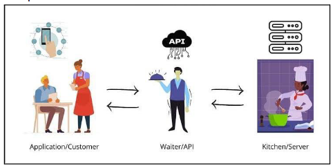

# Building REST APIs with Node.js - Lesson 3 Notes

## 1. What is an API?

**API** = Application Programming Interface

**>> A set of rules and protocols that defines how software products and applications communicate with each other.

###  Restaurant Analogy:
- **You** = Client application
- **Waiter** = API
- **Kitchen** = Server/Database

You give order to waiter → Waiter passes to kitchen → Waiter brings food back

You don't directly interact with kitchen, just like programs don't directly interact with servers.


## 2. What is REST?

**REST** = Representational State Transfer

**>> A style of building APIs using the HTTP protocol (same as websites use)

### HTTP Methods (CRUD Operations):

| Method | Purpose | Example |
|--------|---------|---------|
| **GET** | Read/retrieve data | Get a list of students |
| **POST** | Create new data | Add a new student |
| **PUT** | Update existing data | Update a student's name |
| **DELETE** | Remove data | Delete a student from list |


## 3. What is JSON?

**JSON** = JavaScript Object Notation

**>> Simple format for storing and sharing data (plain text with specific structure)

### Example JSON:
```json
{
  "id": 1,
  "name": "Maria",
  "course": "Computer Science"
}
```

**Why it's important**: Standard format for data exchange in REST APIs


## 4. What is npm?

**npm** = Node Package Manager

** >> a tool that comes with Node.js to install and manage packages (reusable code)

### Install a package:
```bash
npm install express
```

**Package** = Set of reusable code written by someone else


## 5. What is Express?

**Express** = Framework for Node.js

**Framework** = Collection of tools that make programming easier

**Why use Express?**
- Makes REST API creation easier
- Code is shorter and cleaner than using built-in `http` module
- Most popular Node.js framework


## 6. What are Routes?

**Route** = Path that tells the server what to do when a request is made

Each route connects to an HTTP method (GET, POST, PUT, DELETE)

### Simple GET Route Example:
```javascript
app.get('/hello', (req, res) => {
    res.send('Hello World');
});
```


## 7. Building a REST API with Express

### Project Setup:

#### Step 1: Initialize Project
```bash
npm init -y
```
Creates `package.json` (tracks project and dependencies)

#### Step 2: Install Express
```bash
npm install express
```
Downloads Express → adds to `node_modules` folder → updates `package.json`

#### Step 3: Create `app.js` file

### Complete API Code:

```javascript
const express = require('express');
const app = express();
const port = 3000;

// Middleware to parse JSON
app.use(express.json());

// Dummy data (in-memory, not permanent)
const students = [
    { id: 1, name: "Maria" },
    { id: 2, name: "Juan" },
    { id: 3, name: "Jose" }
];

// GET route - return list of students
app.get('/students', (req, res) => {
    res.json(students);
});

// POST route - add a student
app.post('/students', (req, res) => {
    const newStudent = req.body;
    students.push(newStudent);
    res.json({
        message: "Student added successfully",
        student: newStudent
    });
});

// DELETE route - delete a student by id
app.delete('/students/:id', (req, res) => {
    const studentId = parseInt(req.params.id);
    
    // Find the index of the student with that ID
    const index = students.findIndex(student => student.id === studentId);
    
    if (index !== -1) {
        // Remove the student from the array
        const deletedStudent = students.splice(index, 1);
        res.json({
            message: `Student with ID ${studentId} deleted successfully`,
            student: deletedStudent[0]
        });
    } else {
        // If no student found
        res.status(404).json({
            message: `Student with ID ${studentId} not found`
        });
    }
});

app.listen(port, () => {
    console.log(`API is running at http://localhost:${port}`);
});
```

### Run the API:
```bash
node app.js
```

**Note**: Data is stored in memory only (not permanent). Real apps use databases.


## 8. What is curl?

**curl** = Command-line tool to send requests to web servers

**Why use curl?**
- Test APIs without building a frontend
- Simulate GET, POST, PUT, DELETE requests
- Useful for debugging and checking if API works


## 9. Testing API with CURL

### Before testing:
1. Keep `app.js` running in VSCode
2. Open new terminal (choose GitBash terminal)

### a) POST Route - Add New Student
```bash
curl -X POST http://localhost:3000/students -H "Content-Type: application/json" -d '{"id":4,"name":"Ana"}'
```

**Expected Output**:
```json
{
  "message": "Student added successfully",
  "student": { "id": 4, "name": "Ana" }
}
```

### b) GET Route - View All Students

**Option 1 - Using curl**:
```bash
curl http://localhost:3000/students
```

**Option 2 - Using Browser**:
Open: `http://localhost:3000/students`

**Expected Output**:
```json
[
  { "id": 1, "name": "Maria" },
  { "id": 2, "name": "Juan" },
  { "id": 3, "name": "Jose" },
  { "id": 4, "name": "Ana" }
]
```

### c) DELETE Route - Remove Student
```bash
curl -X DELETE http://localhost:3000/students/4
```

**Expected Output**:
```json
{
  "message": "Student with ID 4 deleted successfully",
  "student": { "id": 4, "name": "Ana" }
}
```

**Verify deletion** - Run GET request again. ID 4 should be gone.

---

## 10. Why REST APIs are Important in Cloud Computing

**Cloud applications** = Many small services that need to communicate

**REST APIs** = The standard way for these services to talk to each other

**Without REST APIs** → Modern cloud applications couldn't work together

### Use Cases:
- Microservices communication
- Frontend-backend communication
- Service-to-service integration
- Mobile app backends
- Third-party integrations


## Key Concepts Summary

| Term | Definition |
|------|------------|
| **API** | Interface for programs to communicate |
| **REST** | Style of building APIs using HTTP |
| **JSON** | Data format for exchanging information |
| **npm** | Package manager for Node.js |
| **Express** | Framework that simplifies API creation |
| **Route** | Path that defines server behavior for requests |
| **curl** | Command-line tool for testing APIs |
| **Middleware** | Functions that process requests (e.g., `express.json()`) |


## Code Structure Breakdown

```javascript
const express = require('express');     // Import Express
const app = express();                  // Create Express app
const port = 3000;                      // Define port number

app.use(express.json());                // Middleware to parse JSON

// Routes go here
app.get('/path', (req, res) => {...});
app.post('/path', (req, res) => {...});
app.delete('/path/:id', (req, res) => {...});

app.listen(port, () => {...});          // Start server
```

### Important Objects:
- **req** (request) - Contains data from client
- **res** (response) - Sends data back to client
- **req.body** - Data sent in POST request
- **req.params** - URL parameters (e.g., `:id`)


##  File Structure

```
project-folder/
├── app.js              # Your API code
├── package.json        # Project info & dependencies
└── node_modules/       # Installed packages (auto-generated)
```

